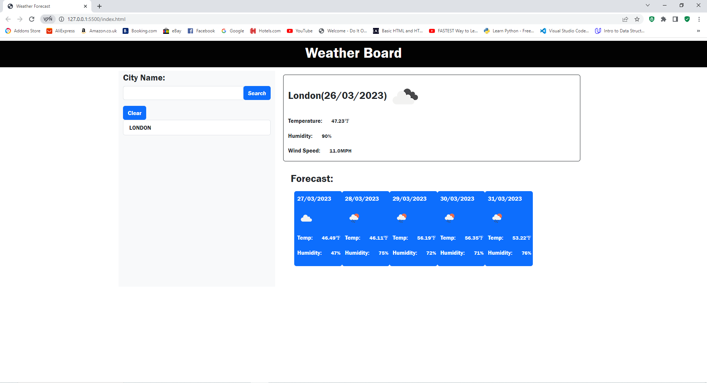

# Weather-Dashboard
## Description
Weather-Dashboard is an application to find a forecast for weather in any given city. The OpenWeatherAPI gets the data for weather for any city which is searched by the user.
You will be able to see the humidity, date, temperature(fahreneit) and icon image for weather status. I used local storage to save each city search and it will be displayed in the history(below the search bar).

### How:
Simply click on the URL and search for any city you want to check the weather for. This will allow you to plan any journey ahead.

* Website: 

<b>Screenshot<b>

* Credits

  .https://openweathermap.org/api
  .https://getbootstrap.com/docs/5.3/getting-started/introduction/
  .https://developer.mozilla.org/en-US/docs/Web/JavaScript/Reference/Global_Objects

